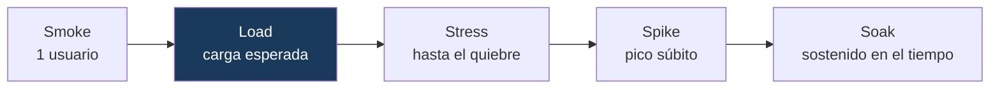
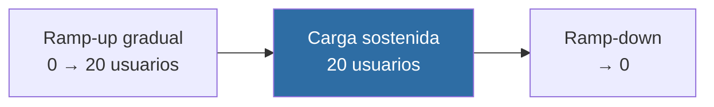

# Performance & Load Testing con k6

Suite de pruebas de **rendimiento** construida con **k6**, que valida la capacidad y la estabilidad de un servicio bajo carga mediante escenarios de load, stress, spike y soak, con **thresholds que funcionan como quality gate** en el pipeline.


---

## Resumen ejecutivo

| | |
|---|---|
| **Qué es** | Automatización de pruebas de rendimiento: cuánta carga soporta el sistema, con qué latencia y cómo se degrada al superarla. |
| **Problema que resuelve** | El testing funcional no dice nada sobre el comportamiento bajo carga. Un sistema puede funcionar con un usuario y colapsar con mil. Este proyecto define SLOs medibles y los verifica automáticamente. |
| **Enfoque** | Escenarios de carga realistas (ramp-up gradual, *think times*, mezcla de operaciones) contra un servicio bajo prueba propio, con umbrales de p95/p99 y tasa de error como gate. |
| **Resultado medido** | Bajo carga esperada (20 usuarios concurrentes): **p95 ≈ 40 ms, 0 % de errores**, con el gate de SLO cumplido. El gate se verificó también en su modo de fallo. |
| **Stack** | k6 · Node.js · GitHub Actions |

> **Nota de responsabilidad:** las pruebas se ejecutan contra un **servicio local propio** (`service/`), nunca contra APIs de terceros. Ejecutar pruebas de carga sobre un servicio ajeno sin autorización equivale a un ataque de denegación de servicio.

---

## Tipos de prueba de rendimiento



| Escenario | Pregunta que responde |
|---|---|
| **Smoke** | ¿El sistema y el script funcionan con carga mínima? |
| **Load** | ¿Cumple los SLOs con la carga esperada de producción? |
| **Stress** | ¿Cuál es el punto de quiebre y cómo se degrada? |
| **Spike** | ¿Resiste un pico súbito y se recupera? |
| **Soak** | ¿Se degrada con el tiempo (fugas de memoria)? |

---

## Thresholds como quality gate

El corazón del enfoque: los SLOs se expresan como umbrales, y k6 **falla con código de salida distinto de cero** si no se cumplen. Así, una regresión de rendimiento **bloquea el pipeline** igual que un test funcional roto.

```javascript
thresholds: {
  http_req_failed:   ['rate<0.01'],              // < 1% de errores
  http_req_duration: ['p(95)<500', 'p(99)<800'], // p95 < 500ms, p99 < 800ms
}
```

Se usa **p95/p99, no el promedio**: el promedio esconde la cola de latencia (un promedio de 200 ms puede ocultar que el 5 % de los usuarios espera 8 segundos).

Este comportamiento de gate está verificado en ambas direcciones: cumple cuando el sistema respeta el SLO, y **falla** cuando se incumple.

---

## Carga realista



El modelo de usuario (`lib/flow.js`) reproduce comportamiento real: la mayoría navega el catálogo, una fracción compra, y todos tienen **think times** (pausas entre acciones). Omitir esto mediría un escenario irreal.

---

## Estructura

```
service/server.mjs        # SUT: API local sin dependencias (el sistema a medir)
lib/
├── config.js             # baseURL + SLOs (thresholds) compartidos
└── flow.js               # flujo de usuario realista reutilizable
scenarios/
├── smoke.js  load.js  stress.js  spike.js  soak.js
scripts/run.mjs           # levanta el SUT, corre k6 y lo apaga (gate incluido)
.github/workflows/ci.yml  # smoke + load como gate en CI
```

---

## Uso

```bash
# k6 debe estar instalado: https://k6.io/docs/get-started/installation/

npm run test:smoke       # verificación rápida (1 usuario)
npm run test:load        # carga esperada (gate de SLO)
npm run test:stress      # hasta el punto de quiebre
npm run test:spike       # pico súbito
npm run test:soak        # carga sostenida
```

Cada comando levanta el servicio local, ejecuta el escenario y apaga el servicio automáticamente.

---

## Documentación técnica

**[docs/DOCUMENTACION-TECNICA.md](docs/DOCUMENTACION-TECNICA.md)** detalla: los tipos de prueba y cuándo usar cada uno, el diseño de carga realista, la interpretación de métricas (percentiles, throughput, saturación), los thresholds como gate, y la integración en CI.

---

## La suite completa

Este repositorio forma parte de una suite de automatización de calidad que cubre el ciclo de testing de punta a punta, de los fundamentos a las prácticas propias de un rol SDET.

**Fundamentos**

1. [Framework E2E de UI](https://github.com/fercarballo/playwright-e2e-framework-saucedemo) — Playwright · Page Object Model
2. [Testing de API](https://github.com/fercarballo/api-testing-framework-restful-booker) — contract testing con Zod
3. [Pipeline CI/CD](https://github.com/fercarballo/qa-automation-cicd-pipeline) — GitHub Actions · quality gates
4. [Estabilidad y flakiness](https://github.com/fercarballo/flakiness-hunting-playwright) — detección y erradicación
5. [Regresión visual & contract testing](https://github.com/fercarballo/visual-and-contract-testing) — Playwright + Pact

**Avanzado (SDET)**

6. **Performance & load testing** — este repositorio
7. [Integración con dependencias reales](https://github.com/fercarballo/integration-testing-testcontainers) — Testcontainers · Postgres
8. [DevSecOps](https://github.com/fercarballo/devsecops-pipeline) — SAST · SCA · DAST en el pipeline
9. [Tooling interno de QA](https://github.com/fercarballo/qa-insights) — test impact + flaky detection
10. [Evals de aplicaciones con IA](https://github.com/fercarballo/llm-evals-harness) — LLM testing

---

## Licencia

MIT.
